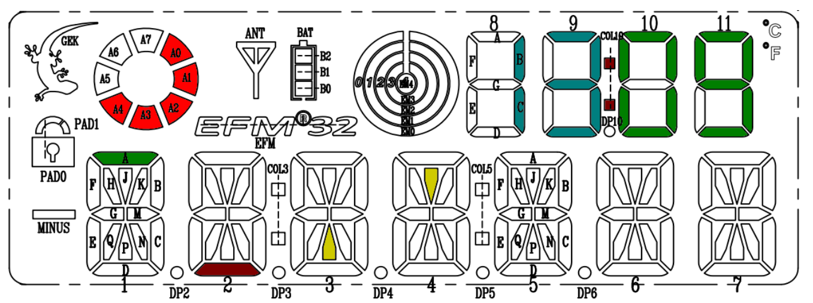

# BAMBI-HF

# Kacsa vadászat (soros port)

## A jéték célja

A képernyőn véletlenszerűen megjelennek kacsák, amiket le kell tudni vadászni. A kacsák az alsó (alfanumerikus) kijelző valamelyik négy mezejének legfelső vízszintes szegmensében jelenhetnek meg véletlenszerűen (lásd zöld jelölést), majd a nehézségi szinttől függő ideig maradnak. A vadásznak (alsó vízszintes szegmens) alájuk kell állnia és lelőni őket.

## A játék indítása

A játék elején lehessen állítani a nehézségi szintet. Pl. a soros porton érkezett ’+’ karakterrel növelni, ’-’ karakterrel csökkenteni lehessen (az aktuális szintet jelezze vissza a soros porton). A játékot indítani pedig az ’s’ karakter elküldésével lehet.

## A játék menete

A vadász a soros porton érkező karakterekkel irányítható (pl. a ’b’ karakterrel balra megy, a ’j’ karakterrel jobbra és az ’a’-val lő). A lövést (sárga szegmens) jelenítsük meg. A találatot villogó kacsa szegmenssel jelezzétek. Összesen 25 kacsa levadászására van lehetőség, utána vége van a játéknak. Az eddig megjelent illetve az eltalált kacsákat a felső (numerikus) kijelzőn számoljátok (pl. az egyik oldali két digiten az egyik értéket, a másik oldali két digiten a másik értéket jelenítsétek meg, középen a kettősponttal elválasztva).

